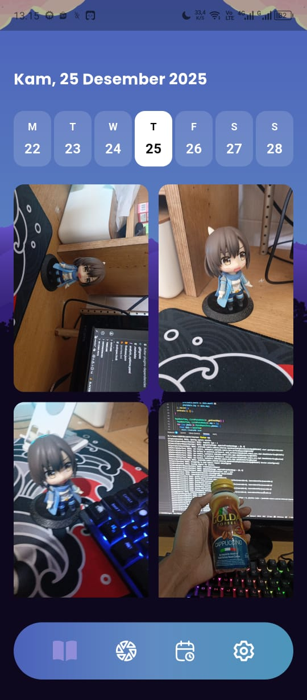
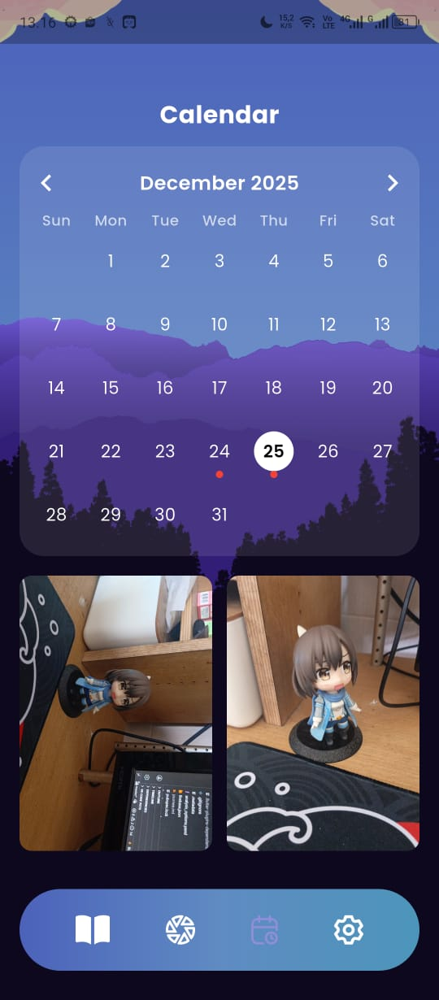
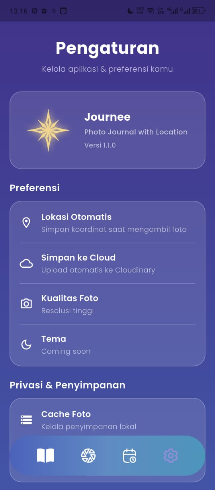

# Journee - Personal Photo Journal App

**Journee** adalah aplikasi mobile berbasis Flutter untuk mencatat momen harian menggunakan foto, lokasi, dan kalender.  

---

## 🚀 Fitur Utama

- **Ambil Foto** 📸  
  Gunakan kamera dengan flash dan switch kamera depan/belakang.

- **Upload dari Galeri** 🖼️  
  Pilih foto dari galeri dan langsung upload ke Cloudinary.

- **Overlay Detail**  
  Lihat foto dengan deskripsi, lokasi, koordinat, dan tombol edit/delete tanpa meninggalkan halaman utama.

- **Deskripsi Foto** ✏️  
  Tambahkan atau edit deskripsi foto kapan saja.

- **Lokasi Otomatis** 🌍  
  Simpan latitude & longitude secara real-time dan tampilkan nama kota.

- **Kalender Foto** 📅  
  Lihat semua foto berdasarkan tanggal, dengan marker merah pada tanggal yang memiliki foto.

- **UI Modern & Responsif**  
  Gradient, awan, gunung, dan desain yang konsisten di seluruh halaman.

---

## 🛠️ Teknologi

- **Flutter & Dart**  
- **Hive** untuk penyimpanan metadata foto lokal  
- **Camera & Image Picker** untuk foto  
- **Geolocator & Geocoding** untuk koordinat dan nama kota  
- **Cloudinary** untuk backup foto cloud  
- **TableCalendar** untuk kalender interaktif  

---

## 📸 Screenshot

  
  
  
  

  

---

📜 Lisensi
MIT License © 2025 Arya Widiana
